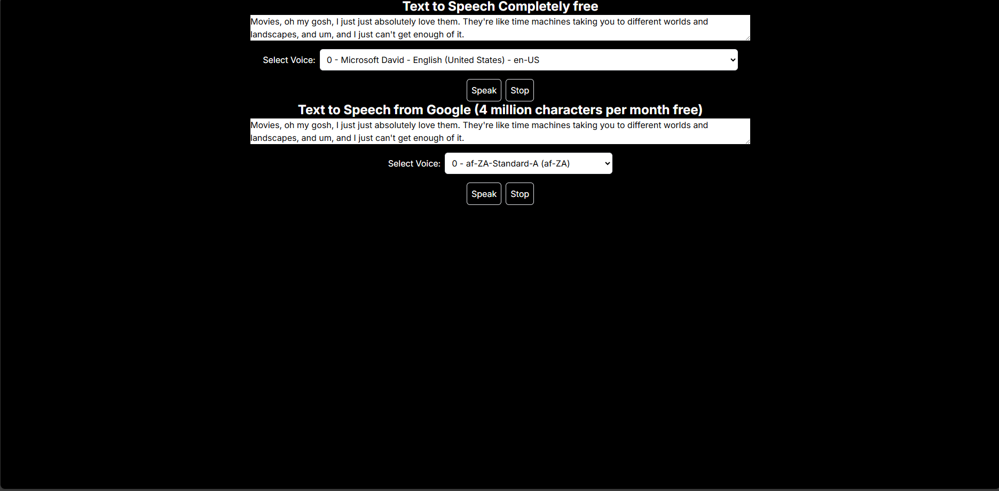

# Text-To-Speech Web Application

This is a web application that provides two types of Text-to-Speech (TTS) services: a free browser-based TTS using `react-speech-kit` and a cloud-based TTS using Google Cloud Text-to-Speech API. The application allows users to input text, select a voice, and listen to the generated speech.

## Features

- **Browser-based Text-to-Speech**: Utilizes `react-speech-kit` for free, client-side text-to-speech synthesis.
- **Google Cloud Text-to-Speech**: Integrates with Google Cloud to provide high-quality speech synthesis with support for multiple voices and languages.
- **Voice Selection**: Users can select different voices for both the free TTS and Google TTS services.
- **Playback Controls**: Includes options to start and stop speech playback.

## Screenshot



## Installation

### Prerequisites

- **Node.js**: Ensure that you have Node.js installed (version 12 or higher).
- **Google Cloud Account**: You will need a Google Cloud account with access to the Text-to-Speech API. Follow the [Google Cloud Text-to-Speech Documentation](https://cloud.google.com/text-to-speech/docs) to set up your API key.

### Clone the Repository

```bash
git clone https://github.com/sazzad4677/Text-To_Speech.git
cd Text-To_Speech
```

### Install Dependencies

```bash
npm install
```

### Setup Environment Variables

- Create a **.env.local** file in the root of your project.
- Add your Google Cloud credentials and API key.

```bash
GOOGLE_APPLICATION_CREDENTIALS=path/to/your-google-cloud-key.json
```

Replace path/to/your-google-cloud-key.json with the actual path to your Google Cloud JSON key file.

### Run the Application

```bash
 npm run dev
```

Open your browser and navigate to http://localhost:3000 to see the application in action.

## Usage

### Free Text-to-Speech

1. Enter the text you want to convert to speech in the first textarea.
2. Select a voice from the dropdown list.
3. Click the "Speak" button to listen to the synthesized speech.
4. Click the "Stop" button to stop the speech at any time.

### Google Cloud Text-to-Speech

1. Enter the text you want to convert to speech in the second textarea.
2. Select a voice from the dropdown list of Google Cloud voices.
3. Click the "Speak" button to listen to the synthesized speech using Google Cloud.
4. Click the "Stop" button to stop the speech at any time.

## Project Structure

- src/app/TextToSpeechComponent.js: Main component handling both free and Google Cloud TTS functionalities.
- pages/api/voices.js: API route to fetch available voices from Google Cloud TTS.
- pages/api/tts.js: API route to handle text-to-speech requests using Google Cloud TTS.

## Contributing

Contributions are welcome! Please open an issue or submit a pull request for any enhancements or bug fixes.

## License

This project is licensed under the MIT License. See the LICENSE file for details.

## Acknowledgements

- react-speech-kit for providing the free, client-side TTS functionality.
- Google Cloud Text-to-Speech for offering high-quality TTS services.
